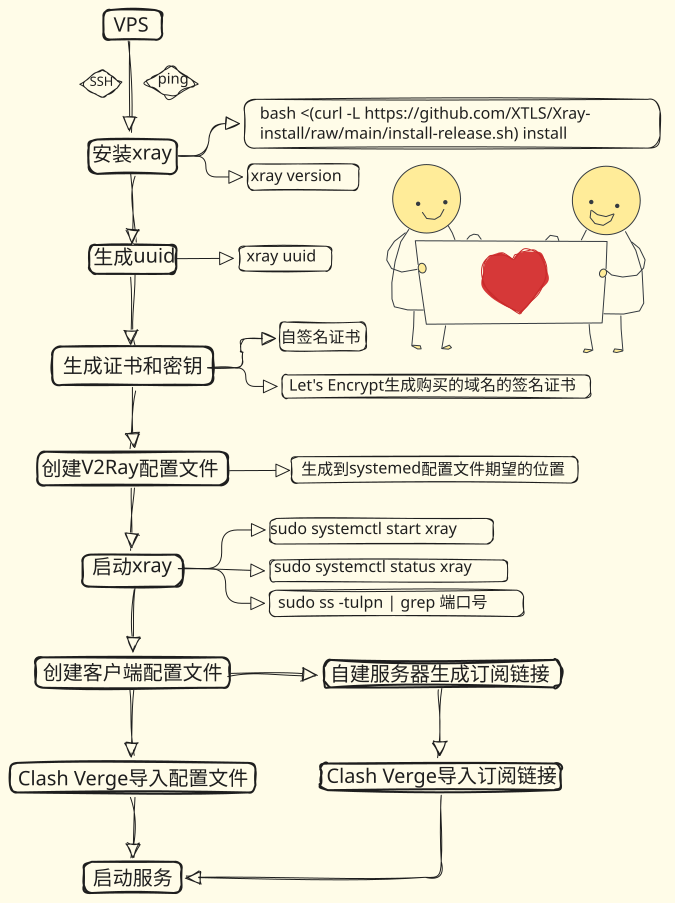

# 🪜 自建服务器部署XRay生成订阅链接

**技术选型：正向代理 —— XRay + Clash**

XRay 的工作模式：**Inbound（入站）** + **Routing（路由规则）** + **Outbound（出站）**

- **Inbound**：客户端连接 XRay 的方式，支持 SOCKS5 / HTTP / Shadowsocks / VMESS（V2Ray 自创协议）等
- **Routing**：访问国内网站时直连不加密；访问外网时加密传输。客户端侧使用 Clash Verge 实现分流
- **Outbound**：XRay 连接目标网站的方式，包括 Freedom（直连）/ Blackhole（丢弃）/ VMESS（连接远程 V2Ray）/ Shadowsocks（连接 SS 服务器）/ Trojan（连接 Trojan 服务器）

---

## 1. 🖥️ 准备 VPS

在 [搬瓦工官网](https://bwh81.net/)（可参考 [搬瓦工中文网](https://www.banwagong.net/) 学习购买流程，建议提前关注是否有优惠码）购买一台服务器（VPS）。

购买后在 **KiwiVM 面板**（从官网"My Services"处打开，同时可在此管理是否自动续费）管理服务器。

使用本机 `ping` 服务器 IP 地址，查看网络连通情况。若网络正常，可根据需要安装系统，常用选项有 Ubuntu、CentOS、Debian 等。

---

## 2. 🔗 连接 VPS

使用 **MobaXterm** 或 **Xshell** 等终端管理工具，通过 SSH 连接服务器。

---

## 3. 🚀 服务器端部署 XRay

一键部署命令：

```bash
# 下载官方安装脚本
bash <(curl -L https://github.com/XTLS/Xray-install/raw/main/install-release.sh) install

# 验证安装
xray version

# 查看安装目录
which xray
```

---

## 4. 🔑 生成 UUID

**UUID 作为客户端与服务器之间的身份凭证（客户端与服务端配置文件中的 `id` 必须一致才能正常连接）**

```bash
xray uuid

# 或者
uuidgen
```

> 📝 请记录好生成的 UUID，后续配置步骤中会用到。

---

## 5. 📜 生成证书和密钥并设置权限

关于证书，有以下两种方案：

- **方案一（推荐）**：购买域名（如 `domain.com`、`domain.cn`、`domain.io` 等），用域名替代 IP 地址，隐蔽性更强、更安全。可使用 Namecheap 等服务配置 DNS（DNS 负责将域名解析为对应的 IP 地址），再通过 **Let's Encrypt** 申请由权威证书颁发机构（CA）签发的真实证书。
- **方案二（本文采用）**：不购买域名，自行签发证书。自签名证书不受浏览器或客户端信任，但用于自用已足够，无需 CA 认证。缺点是会直接暴露 VPS 的 IP 地址，流量特征也更容易被识别为代理。

以下使用**方案二**生成自签名证书：

```bash
# 第 1 步：创建证书目录
sudo mkdir -p /etc/xray/certs
cd /etc/xray/certs

# 第 2 步：生成私钥
sudo openssl genrsa -out server.key 2048

# 第 3 步：生成证书请求
# 注意：换行符前面有空格 ' \'，第二行也需要先空格再输入参数
sudo openssl req -new -key server.key -out server.csr \
  -subj "/C=US/ST=State/L=City/O=Org/CN=example.com"

# 第 4 步：自签名证书
sudo openssl x509 -req -days 365 -in server.csr \
  -signkey server.key -out server.crt

# 第 5 步：设置权限
sudo chmod 644 server.key
sudo chmod 644 server.crt

# 第 6 步：验证
sudo ls -la /etc/xray/certs/
```

> ⚠️ XRay 配置文件中的证书路径需与此处保持一致。

---

## 6. ⚙️ 配置 XRay 服务器

### 6.1 创建服务器配置文件

安装 XRay 后，会在默认路径下生成 `/etc/systemd/system/xray.service`，其中的关键参数为：

```
ExecStart=/usr/local/bin/xray run -c /usr/local/etc/xray/config.json
```

这表示 XRay 默认从 `/usr/local/etc/xray/config.json` 读取配置文件，因此配置文件需放置在该路径下（也可自行修改此参数指向其他路径）。

```bash
sudo mkdir -p /usr/local/etc/xray
sudo nano /usr/local/etc/xray/config.json
```

### 6.2 VLESS 服务器配置

```json
{
  "log": {
    "loglevel": "warning"
  },
  "inbounds": [
    {
      "port": 端口,
      "protocol": "vless",
      "settings": {
        "clients": [
          {
            "id": "之前生成的 UUID",
            "level": 0,
            "email": "user@v2ray.com"
          }
        ],
        "decryption": "none"
      },
      "streamSettings": {
        "network": "tcp",
        "security": "tls",
        "tlsSettings": {
          "serverName": "example.com",
          "certificates": [
            {
              "certificateFile": "/etc/xray/certs/server.crt",
              "keyFile": "/etc/xray/certs/server.key"
            }
          ]
        }
      }
    }
  ],
  "outbounds": [
    {
      "protocol": "freedom",
      "settings": {}
    }
  ]
}
```

**参数说明：**

| 参数                              | 说明                                                                                        |
| --------------------------------- | ------------------------------------------------------------------------------------------- |
| `port`                          | 监听端口                                                                                    |
| `id`                            | UUID，需与客户端一致                                                                        |
| `decryption`                    | 加密方式，选 `none` 表示不在 VLESS 层额外加密（因为已启用 TLS，无需重复加密，可节省性能） |
| `serverName`                    | 需与证书中的 CN 字段保持一致                                                                |
| `certificateFile` / `keyFile` | 指向第 5 步生成的自签名证书路径                                                             |
| `protocol`（outbound）          | `freedom` 表示出站直连目标网站                                                            |

验证配置是否正确：

```bash
# 测试配置文件语法
xray run -c /usr/local/etc/xray/config.json -test

# 输出应该显示：
# Configuration OK.
```

---

## 7. 🟢 使用 systemd 启动 XRay

```bash
# 启动 XRay 服务
sudo systemctl start xray

# 查看服务状态
sudo systemctl status xray

# 输出应该显示：
# Active: active (running)
```

---

## 8. ✅ 验证 XRay 是否正常运行

```bash
# 查看实时日志
sudo journalctl -u xray -f

# 按 Ctrl+C 退出日志

# 检查端口是否监听
sudo ss -tulpn | grep 端口

# 输出应该显示：
# tcp  LISTEN  0  128  0.0.0.0:端口  0.0.0.0:*  users:(("xray",pid=xxxx,fd=x))
```

如果端口未在监听，运行以下命令查看 XRay 的报错信息：

```bash
sudo journalctl -u xray -n 50 --no-pager
```

---

## 9. 💻 配置客户端

**此处选择 Clash Verge**

新建一个 `config.yaml` 配置文件，以下是各部分配置项说明：

- **监听地址**：设为 `127.0.0.1` 则只有本机可用；设为 `0.0.0.0` 则局域网内其他设备也可共享，安全性相应降低
- **节点**：单节点延迟高时无法切换，配置多节点可提高稳定性。一台 VPS 实现多节点可通过多端口运行多个 XRay 实例，或在多个域名下部署，但会增加 VPS 的负载
- **geosite 数据库**：大小约几 MB，记录了大部分网站所属区域，Clash 可据此自动判断是否走代理。建议先手动配置常用代理网站后再启用
- **TUN 模式**：开启后所有应用流量（包括游戏、其他软件等）都走代理，可实现全局代理效果，但需要管理员/root 权限，可能影响系统稳定性。不开启时仅支持浏览器等支持系统代理的应用翻墙，建议初次使用先不开启
- **keep-alive-interval**：心跳检测间隔，设为 `30` 表示每 30 秒检测一次连接，防止数据丢包或网络中断。追求稳定可设 10~30 秒；想节省流量可设 60 秒
- **Clash Verge 优先级**：Clash Verge 界面中的设置优先级高于配置文件。例如，配置文件中 TUN 设为 `false`，但在 Clash Verge 界面手动开启 TUN 模式，依然可以生效

```yaml
# ============================================
# 【第一部分：基础设置】
# ============================================

# HTTP 代理端口
port: 7890

# SOCKS5 代理端口
socks-port: 7891

# HTTP 重定向端口（用于透明代理）
redir-port: 7892

# 代理模式
mode: rule

# 日志级别：silent（静默） | info（信息） | warning（警告） | error（错误）
log-level: info

# 是否允许局域网访问
allow-lan: true

# 监听地址：127.0.0.1（仅本机） | 0.0.0.0（局域网可访问）
bind-address: 0.0.0.0

# ============================================
# 【第二部分：DNS 配置】
# ============================================

dns:
  enable: true
  
  # 使用的 DNS 服务器
  nameserver:
    - 8.8.8.8          # Google DNS
    - 1.1.1.1          # Cloudflare DNS
    - 114.114.114.114  # 国内 DNS
  
  # 针对特定域名指定 DNS 服务器
  nameserver-policy:
    # 国内域名使用国内 DNS
    'geosite:cn': 114.114.114.114
    # 被墙域名使用国外 DNS
    'geosite:geolocation-!cn': 8.8.8.8

# ============================================
# 【第三部分：代理节点定义】
# ============================================

proxies:
  # 节点 1：自建的 XRay VPS
  - name: "🇸🇬 My-Xray-SG"              # 节点名称（显示在 UI 中）
    type: vless                          # 协议类型：vless
    server: xxx.xxx.xxx.xxx              # 🔴 改为你的 VPS IP
    port: 端口                           # 🔴 改为你的 VPS 端口
    uuid: xxxxxxxxxxxxxxxxxxxxxxxxxxx    # 🔴 改为你的 UUID
  
    # 传输设置
    network: tcp                         # 传输协议：tcp | udp | ws | grpc
    tls: true                            # 是否启用 TLS 加密
    servername: example.com              # 🔴 改为你的 SNI（需与证书 CN 字段一致）
  
    # 高级选项
    udp: true                            # 是否支持 UDP
    # skip-cert-verify: false            # 是否跳过证书验证（自签名证书需要设为 true）
  
    # 使用自签名证书时，启用以下配置：
    skip-cert-verify: true

  # 节点 2：如果有多个节点，可以这样添加
  # - name: "🇯🇵 VPS-Tokyo"
  #   type: vless
  #   server: another-ip.com
  #   port: 端口2
  #   uuid: another-uuid-here
  #   network: tcp
  #   tls: true
  #   servername: another-domain.com

# ============================================
# 【第四部分：代理组（分流策略）】
# ============================================

proxy-groups:
  # 分组 1：手动选择代理
  - name: "🌍 手动选择"
    type: select                         # select = 手动选择
    proxies:
      - "🇸🇬 My-Xray-SG"
      - "DIRECT"                         # 直连选项
  
  # 分组 2：自动选择（根据延迟）
  - name: "⚡ 自动选择"
    type: url-test                       # url-test = 根据延迟自动选择最优节点
    proxies:
      - "🇸🇬 My-Xray-SG"
    url: http://www.gstatic.com/generate_204  # 延迟检测 URL
    interval: 300                        # 检测间隔（秒）
    tolerance: 50                        # 延迟容差（毫秒）
  
  # 分组 3：全局代理（默认出口）
  - name: "🎯 全局"
    type: select
    proxies:
      - "⚡ 自动选择"
      - "🌍 手动选择"
      - "DIRECT"

# ============================================
# 【第五部分：分流规则】
# ============================================

rules:
  # ========== 【1. 国内网站直连】==========
  
  # 常用国内域名
  - DOMAIN-SUFFIX,baidu.com,DIRECT
  - DOMAIN-SUFFIX,qq.com,DIRECT
  - DOMAIN-SUFFIX,aliyun.com,DIRECT
  - DOMAIN-SUFFIX,alibaba.com,DIRECT
  - DOMAIN-SUFFIX,bilibili.com,DIRECT
  - DOMAIN-SUFFIX,netease.com,DIRECT
  - DOMAIN-SUFFIX,163.com,DIRECT
  - DOMAIN-SUFFIX,sina.com.cn,DIRECT
  - DOMAIN-SUFFIX,weibo.com,DIRECT
  - DOMAIN-SUFFIX,wechat.com,DIRECT
  - DOMAIN-SUFFIX,taobao.com,DIRECT
  - DOMAIN-SUFFIX,jd.com,DIRECT
  
  # 使用 geosite 数据库（需提前下载）
  - GEOSITE,CN,DIRECT
  
  # ========== 【2. 被墙网站走代理】==========
  
  # Google
  - DOMAIN-SUFFIX,google.com,🎯 全局
  - DOMAIN-SUFFIX,google.cn,🎯 全局
  - DOMAIN-SUFFIX,googleapis.com,🎯 全局
  - DOMAIN-SUFFIX,gstatic.com,🎯 全局
  - DOMAIN-SUFFIX,googleusercontent.com,🎯 全局
  
  # YouTube
  - DOMAIN-SUFFIX,youtube.com,🎯 全局
  - DOMAIN-SUFFIX,youtu.be,🎯 全局
  - DOMAIN-SUFFIX,ytimg.com,🎯 全局
  
  # Facebook / Meta
  - DOMAIN-SUFFIX,facebook.com,🎯 全局
  - DOMAIN-SUFFIX,instagram.com,🎯 全局
  - DOMAIN-SUFFIX,whatsapp.com,🎯 全局
  - DOMAIN-SUFFIX,fbcdn.net,🎯 全局
  
  # Twitter / X
  - DOMAIN-SUFFIX,twitter.com,🎯 全局
  - DOMAIN-SUFFIX,x.com,🎯 全局
  - DOMAIN-SUFFIX,t.co,🎯 全局
  - DOMAIN-SUFFIX,twimg.com,🎯 全局
  
  # GitHub
  - DOMAIN-SUFFIX,github.com,🎯 全局
  - DOMAIN-SUFFIX,githubusercontent.com,🎯 全局
  - DOMAIN-SUFFIX,githubassets.com,🎯 全局
  
  # Wikipedia
  - DOMAIN-SUFFIX,wikipedia.org,🎯 全局
  - DOMAIN-SUFFIX,wikimedia.org,🎯 全局
  
  # 其他常见被墙网站
  - DOMAIN-SUFFIX,telegram.org,🎯 全局
  - DOMAIN-SUFFIX,t.me,🎯 全局
  - DOMAIN-SUFFIX,openai.com,🎯 全局
  - DOMAIN-SUFFIX,anthropic.com,🎯 全局
  - DOMAIN-SUFFIX,reddit.com,🎯 全局
  - DOMAIN-SUFFIX,netflix.com,🎯 全局
  - DOMAIN-SUFFIX,hulu.com,🎯 全局
  - DOMAIN-SUFFIX,hbo.com,🎯 全局
  - DOMAIN-SUFFIX,dropbox.com,🎯 全局
  
  # ========== 【3. IP 归属判断】==========
  
  # 国内 IP 段直连
  - GEOIP,CN,DIRECT
  
  # ========== 【4. 兜底规则】==========
  
  # 其他所有流量走代理
  - MATCH,🎯 全局

# ============================================
# 【第六部分：TUN 配置（可选）】
# ============================================

tun:
  enable: false         # 改为 true 可启用 TUN 全系统代理
  stack: system         # 使用系统网络栈
  # device: utun0       # macOS / iOS
  # device: tun0        # Linux
  # device-id: local    # Windows
  
  # TUN 启用后，所有应用的流量都会经过代理，无需逐个应用单独配置

# ============================================
# 【第七部分：高级选项】
# ============================================

# 心跳检测间隔（秒）
keep-alive-interval: 30

# IPv6 支持
ipv6: false

# 状态持久化
profile:
  store-selected: true  # 记住上次选择的代理节点
  store-fake-ip: true   # 记住 Fake IP 映射关系

# ============================================
# 【使用说明】
# ============================================
# 
# 1. 必须修改的地方（🔴 标记）：
#    - server:     你的 VPS IP
#    - port:       你的 VPS 端口
#    - uuid:       你的 UUID
#    - servername: 你的 SNI（与证书 CN 字段一致）
#
# 2. 如果使用自签名证书：
#    - 设置 skip-cert-verify: true
#
# 3. 如果有多个 VPS 节点：
#    - 在 proxies 下继续添加更多节点配置
#
# 4. 如果想调整代理策略：
#    - 修改 rules 部分，或在 Clash Verge UI 中手动选择
#
# 5. 启用 TUN 全系统代理：
#    - 设置 tun.enable: true
#    - 需要管理员 / root 权限
#
# ============================================
```

---

## 10. 🧪 测试连接

```bash
# 在客户端（电脑）上用 Clash Verge 导入配置后

# 命令行测试（使用 Clash 的 SOCKS5 代理）
curl --socks5 127.0.0.1:7891 https://ipinfo.io

# 输出应该显示你 VPS 的 IP 地址，而非你的真实 IP
```

---

## 11. 🔗 在服务器上生成订阅链接

当前已可以在 Clash Verge 中通过加载 `config.yaml` 文件使用代理。通过**订阅链接**来分发配置相比直接导入文件更为方便，也更易于管理多用户。常见实现方式有：

- **GitHub Gist 托管**：将配置文件上传至 GitHub Gist，设为 Secret（不公开），Gist 页面的 URL 即为订阅链接
- **Vercel / Netlify 托管**：类似 GitHub，通过静态托管平台分发
- **自建服务器管理**：安全性和隐私性更强，更新订阅、管理用户也更灵活

本文采用第三种方式，在服务器上使用 **Node.js** 搭建订阅服务。

---

### 11.1 安装 Node.js

```bash
# 更新系统软件包
sudo apt update && sudo apt upgrade -y

# 安装 Node.js（推荐使用最新 LTS 版本，如 22.x）
curl -fsSL https://deb.nodesource.com/setup_22.x | sudo -E bash -
sudo apt install -y nodejs

# 验证安装
node --version
npm --version
```

---

### 11.2 创建项目目录

```bash
# 创建项目文件夹
mkdir -p /etc/clash-subscription
cd /etc/clash-subscription

# 初始化 npm 项目
npm init -y

# 安装依赖
npm install express yaml
```

> 💡 执行 `npm init -y` 后终端可能显示一个包含 `"Error: no test specified"` 字样的输出，这只是 `package.json` 模板中的占位内容，表示"尚未配置测试命令"，仅在执行 `npm test` 时才会触发，不影响项目正常运行，忽略即可。

---

### 11.3 创建配置服务器

`server.js` 是基于 Node.js 的 **Express** 框架搭建的 HTTP 服务，本质上是在 `config.yaml` 的基础上额外增加了以下内容：

- **Express 路由**：监听 HTTP 请求并返回 YAML 配置
- **监听端口**：对外暴露服务接口
- **响应头设置**：正确设置 `Content-Type` 为 YAML 格式

将生成的 `server.js` 放置到项目目录 `/etc/clash-subscription` 下即可。

---

### 11.4 测试服务器

```bash
# 启动服务器
node server.js

# 输出应该显示：
# ✅ Clash 订阅服务器运行在 http://localhost:3000
```

在另一个终端中进行测试：

```bash
# 测试默认订阅
curl http://localhost:3000/subscribe

# 测试指定用户订阅
curl http://localhost:3000/subscribe/user1

# 应返回 YAML 格式的配置文件内容
```

---

## 📋 总结

完整的搭建流程如下图所示：



在此基础上，还可以进一步增强以下配置：

- 🌐 **购买域名**：用域名替代 IP 地址，配置 DNS 解析，提高隐蔽性和安全性
- 🔀 **多节点部署**：使用多台 VPS、多个域名或多个端口配置多个节点，提升连接稳定性
- 🔒 **Nginx 反向代理 + HTTPS**：
  - 使用 Nginx 反向代理，将外部访问统一收敛到 **443 端口（HTTPS）**，而不是直接暴露 XRay 所在的端口
  - 配合 Let's Encrypt 申请 TLS 证书，使订阅链接走 HTTPS 传输，配置文件内容以密文传输，避免明文暴露
  - ⚠️ Nginx + HTTPS 配置需要提前拥有一个域名才能申请 Let's Encrypt 证书

---

## ♻️ VPS 重启后手动恢复服务

若未配置开机自启，VPS 重启后需手动按以下顺序启动服务：

```bash
# 1. 启动 XRay
sudo systemctl start xray

# 2. 启动 Node.js 订阅服务（替换为你的实际目录和文件名）
cd /etc/clash-subscription
node server.js
```

---

## 🚦 配置开机自启动

### XRay 开机自启

```bash
# 设置开机自启
sudo systemctl enable xray
```

常用管理命令：

```bash
sudo systemctl start xray      # 启动服务
sudo systemctl status xray     # 查看运行状态
sudo systemctl restart xray    # 重启服务
sudo systemctl stop xray       # 停止服务
sudo journalctl -u xray -f     # 实时查看日志
```

---

### Node.js 服务开机自启（使用 PM2）

PM2 是 Node.js 生产环境中最常用的进程管理工具，支持开机自动恢复进程。

```bash
# 安装 PM2
npm install -g pm2

# 启动服务（在 server.js 所在目录执行）
pm2 start server.js --name "clash-subscription"

# 注册开机自启（执行后按提示复制粘贴输出的命令）
pm2 startup

# 保存当前进程列表（重启后自动恢复）
pm2 save
```

常用管理命令：

```bash
pm2 status                        # 查看所有进程状态
pm2 logs clash-subscription       # 查看服务日志
pm2 restart clash-subscription    # 重启服务
pm2 stop clash-subscription       # 停止服务
```
